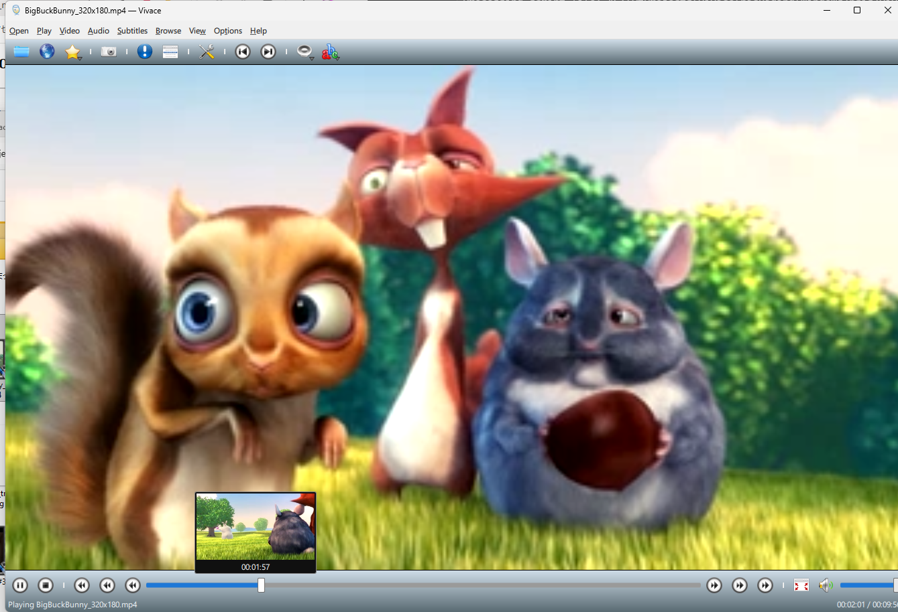

# Vivace

**Vivace** (pronounced *vee-VAH-cheh* — the musical tempo marking for "lively") is a fast,
pure-Qt media player: Qt Multimedia's FFmpeg backend for playback, QML for the UI.
No external player processes, no widgets.

Vivace is a ground-up successor to the ideas of SMPlayer, without the mplayer/mpv
process backends.

**[Download the latest release](https://github.com/Sportacandy/vivace/releases)**
— Windows installer, Linux tarball, and macOS `.dmg`. A rolling
[nightly build](https://github.com/Sportacandy/vivace/releases/tag/nightly)
is also published from the tip of `main` between tagged releases.



## Status

**v0.1.1** — fixes a critical Windows issue where AV1 video hung/leaked
memory instead of playing (see "AV1 support" below). Vivace is a working
daily-driver media player:
playback (mkv/mp4/mpeg2, seeking, embedded + external subtitles, audio/subtitle
track switching, speed control with pitch compensation), a full SMPlayer-style
menu layout (Open/Play/Video/Audio/Subtitles/Browse/View/Options/Help),
playlists, favorites, bookmarks, a video equalizer, screenshots, unencrypted
DVD playback (including interactive menus), optional YouTube playback/download
(via yt-dlp), OpenSubtitles search, casting to a phone/tablet over an embedded
web server, OS media integration (Windows SMTC, Linux MPRIS2), credentials
stored securely via the OS keychain, and Windows/Linux/macOS installers (the
Windows installer also registers Vivace as a file-type option in Windows'
Default Apps, so it appears as a candidate for opening media files right
after installing). UI translated into 24 languages, partial coverage
elsewhere.

Prebuilt packages: see [Releases](https://github.com/Sportacandy/vivace/releases) —
a Windows NSIS installer, a Linux `.tar.gz`, and a macOS `.dmg`, plus a
rolling nightly build from `main`.

## Requirements

- Qt 6.11 or later (Quick, Multimedia)
- CMake 3.24+
- A C++17 compiler (developed with MSVC 2022 on Windows)

## AV1 support

**Windows** prebuilt releases and the [nightly build](https://github.com/Sportacandy/vivace/releases/tag/nightly)
play AV1 video: CI swaps in a patched Qt Multimedia FFmpeg plugin plus a
`libdav1d`-enabled FFmpeg build right after installing Qt. This same swap
also carries the improved audio speed/pitch compensation described below,
since both fixes now ship in one combined bundle. **Linux and macOS**
prebuilt releases, and Vivace built normally against a stock Qt on any
platform, get **neither**: AV1 files show "Unsupported media, a codec is
missing" and play audio only, and speed control falls back to Qt's stock
pitch-compensation behavior.

This isn't a Vivace-specific limitation: Qt's own official FFmpeg build
ships without `libdav1d`/AV1 decode support at all. Investigation found a
likely reason: AV1's *hardware*-accelerated decode path (e.g. D3D11VA on
Windows) hangs and leaks memory rather than failing cleanly on at least
some GPU/driver combinations, rather than this being a licensing choice —
enabling AV1 without very careful hwaccel-failure handling is a real
stability risk across the huge range of real-world hardware.

To get AV1 support elsewhere (Linux/macOS, or a Vivace you build yourself):

**Windows quick path**: download the prebuilt, patched
[`ffmpegmediaplugin.dll` + dav1d-enabled FFmpeg bundle](https://github.com/Sportacandy/vivace/releases/tag/qt-patched-prebuilt-win64)
(the same one CI uses — it includes both the AV1 fix and the speed/pitch
compensation fix below) and copy its files into your own Qt 6.11.1
`msvc2022_64` installation — `ffmpegmediaplugin.dll` into
`plugins/multimedia/`, the rest (`avcodec-61.dll`, `avformat-61.dll`,
`avutil-59.dll`, `swresample-5.dll`, `swscale-8.dll`) into `bin/`,
overwriting the existing files. No rebuild needed; just rebuild Vivace
itself against that same Qt install afterward.

To build it yourself from scratch (any platform, including Linux/macOS),
you need a **custom-built Qt**:

1. Build (or download a prebuilt) FFmpeg with `libdav1d` enabled — e.g.
   [BtbN/FFmpeg-Builds](https://github.com/BtbN/FFmpeg-Builds)' `n7.1` line
   (`*-gpl-shared-7.1.*`), which conveniently matches the soname versions of
   Qt's own officially bundled FFmpeg.
2. Apply [`patches/qtmultimedia-av1-hwaccel-disable.patch`](patches/qtmultimedia-av1-hwaccel-disable.patch)
   to your `qtmultimedia` source checkout — this forces AV1 decoding through
   the software `libdav1d` decoder specifically, since Qt's *hardware*-
   accelerated AV1 path is the actual source of the hang/leak, not AV1
   decoding itself.
3. Configure Qt with `-DFFMPEG_DIR=<path to your dav1d-enabled FFmpeg>
   -DQT_DEPLOY_FFMPEG=TRUE` and rebuild (`qtmultimedia` alone is enough if
   you don't want to rebuild all of Qt).
4. Build Vivace against that custom Qt as usual.

(Optionally also apply the speed/pitch compensation patch from the next
section to the same `qtmultimedia` checkout before rebuilding — both
patches touch different files and apply independently.)

## Audio speed/pitch compensation

Vivace's speed control (`Play > Speed`) can preserve pitch when playing
faster or slower than 1x ("pitch compensation" in Preferences). With a
**stock Qt**, this uses Qt's built-in phase-vocoder algorithm for every
speed, which sounds clean when slowing down but produces audible vibrato/
echo when speeding up (e.g. 2x) on speech-heavy content.

**Windows** prebuilt releases and the nightly build get the fix below via
the same combined [prebuilt bundle](https://github.com/Sportacandy/vivace/releases/tag/qt-patched-prebuilt-win64)
described in "AV1 support" above. **Linux and macOS** prebuilt releases,
and Vivace built normally against a stock Qt on any platform, use Qt's
stock behavior — there is no artifact-free option without a custom Qt
build, for the same reason as AV1: the fix requires source changes to
`qtmultimedia` itself, not just Vivace.

Investigation found the phase vocoder and the alternative WSOLA (time-
domain) approach have exactly opposite strengths: the phase vocoder holds
up well slowing down but degrades speeding up (denser frame overlap makes
phase-coherence harder), while WSOLA is clean speeding up but introduces a
buzz/seam artifact slowing down (it has to repeat audio to fill time,
without pitch-synchronized splicing). So the fix uses each algorithm only
in the direction it's strong: WSOLA (via the vendored
[SoundTouch](https://codeberg.org/soundtouch/soundtouch) library) above 1x,
Qt's original phase vocoder below 1x.

To build this yourself, apply
[`patches/qtmultimedia-wsola-pitch-compensation.patch`](patches/qtmultimedia-wsola-pitch-compensation.patch)
to your `qtmultimedia` source checkout (vendors SoundTouch alongside Qt's
existing Signalsmith Stretch phase vocoder, then picks per playback
direction), rebuild `qtmultimedia`, and rebuild Vivace against that Qt.
(This patch is independent of the AV1 one above and can be applied to the
same checkout either alongside it or on its own.)

## Building

```
cmake -S . -B build -DCMAKE_PREFIX_PATH=C:/Qt/6.11.1/msvc2022_64
cmake --build build --config Release
```

Or open `CMakeLists.txt` in Qt Creator and hit Run.

Usage: `vivace [file-or-url]`, or drag & drop a file onto the window.

## Packaging (installers)

Vivace deploys with Qt's CMake deployment API (`cmake --install`, which drives
`windeployqt` on Windows and `macdeployqt` on macOS, and uses CMake's own
dependency scanning on Linux — there is no `linuxdeployqt` in Qt 6). On
**Windows** you choose the installer backend with `-Installer`:

- **`NSIS`** (default) — `nsis/vivace.nsi` via `makensis`; the primary installer.
- **`IFW`** — the **Qt Installer Framework** (`binarycreator`).

macOS defaults to the Qt Installer Framework too, or pass `--dmg` for a plain
`.dmg` (via `macdeployqt`, no IFW needed — this is what CI/releases use).
Linux defaults to the Qt Installer Framework, or pass `--tarball` for a plain
`.tar.gz` of the deployed tree (no IFW needed — also what CI/releases use,
since IFW has no package manager entry and building/installing it is its own
undertaking; a tarball is enough for this stage).

Prerequisites, in addition to the build requirements above:

- **NSIS** (Windows default) — install from <https://nsis.sourceforge.io>;
  `makensis.exe` is auto-detected under `Program Files\NSIS` (or pass `-NsisDir`).
- **Qt Installer Framework** — only needed for `-Installer IFW` / the Linux
  and macOS default modes (skip it with `--tarball` / `--dmg`). Install
  a prebuilt copy with the Qt Maintenance Tool (*Qt → Developer and Designer
  Tools → Qt Installer Framework*), or build it from source for single-file
  installers — see [`packaging/README.md`](packaging/README.md). It must be a
  **fully static** build (verify `dumpbin /dependents binarycreator.exe` shows
  only system DLLs).
- Linux only: `patchelf` (used by the CMake deploy to fix rpaths).

Build the installer — pick the backend you want:

```powershell
# Windows (PowerShell) — NSIS (default)          -> VivaceSetup-Release.exe
packaging\windows\build_installer.ps1 -QtDir C:/Qt/6.11.1/msvc2022_64

# Windows — Qt Installer Framework instead        -> VivaceSetup-Release-IFW.exe
packaging\windows\build_installer.ps1 -Installer IFW -QtDir C:/Qt/6.11.1/msvc2022_64 `
    -IfwDir C:/Qt/Tools/QtInstallerFramework/<ver>/bin
```
```bash
# Linux — Qt Installer Framework installer, or a .tar.gz with --tarball
QT_DIR=~/Qt/6.11.1/gcc_64 packaging/linux/build_installer.sh
QT_DIR=~/Qt/6.11.1/gcc_64 packaging/linux/build_installer.sh --tarball

# macOS — Qt Installer Framework installer, or a .dmg with --dmg
QT_DIR=~/Qt/6.11.1/macos packaging/macos/build_installer.sh
QT_DIR=~/Qt/6.11.1/macos packaging/macos/build_installer.sh --dmg
```

`-NsisDir`, `-IfwDir` (and `IFW_DIR` on Unix) are auto-detected if omitted. Each
script configures a Release build, deploys the Qt runtime + QML + plugins +
FFmpeg into the installer's staging dir, and writes `VivaceSetup-*` /
`Vivace-linux-x86_64.tar.gz` / `Vivace-macos.dmg` to the repo root. See
[`packaging/README.md`](packaging/README.md) for the full details and follow-ups.

Keys: `Space` play/pause · `←/→` seek ±5 s · `↑/↓` volume · `M` mute · `F` fullscreen ·
`Ctrl+O` open.

## License

GPL-3.0-or-later. See [LICENSE](LICENSE).
