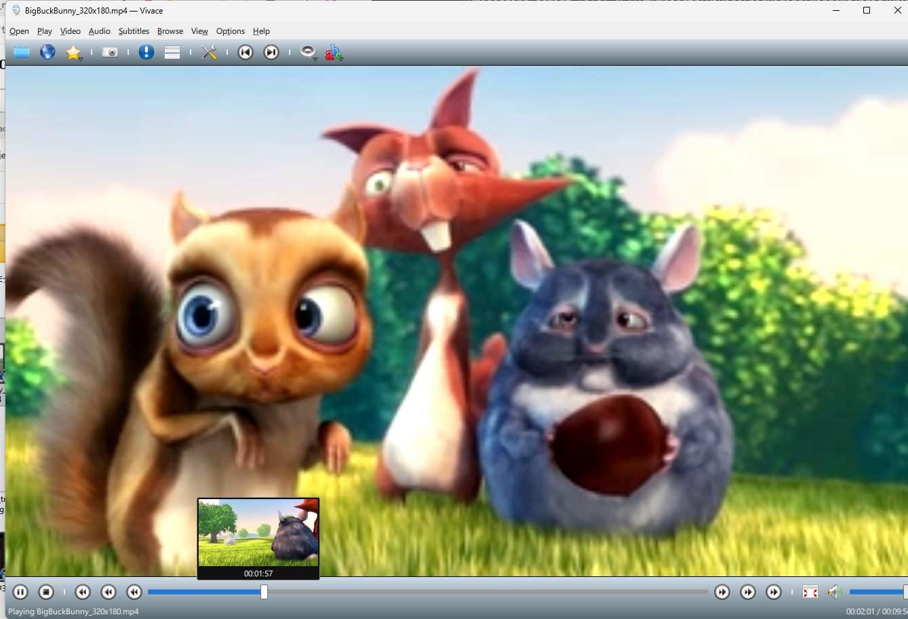

# Vivace

**Vivace** (pronounced *vee-VAH-cheh* — the musical tempo marking for "lively") is a fast,
pure-Qt media player: Qt Multimedia's FFmpeg backend for playback, QML for the UI.
No external player processes, no widgets.

Vivace is a ground-up successor to the ideas of SMPlayer, without the mplayer/mpv
process backends.

**[Download the latest release](https://github.com/Sportacandy/vivace/releases)**
— Windows installer, Linux tarball, and macOS `.dmg`. A rolling
[nightly build](https://github.com/Sportacandy/vivace/releases/tag/nightly)
is also published from the tip of `main` between tagged releases. See
[CHANGELOG.md](CHANGELOG.md) for what's changed in each release.



## Status

**v0.4.0** — adds Video ▸ Deinterlace (None/Yadif/Bwdif) and matures Blu-ray
Disc playback (added in v0.3.2's development): multi-clip titles now play
back gaplessly, and selecting a Blu-ray subtitle (PG/PGS) track correctly
renders on screen (both need the custom-built Qt Multimedia described
below — see "Blu-ray Disc playback"). Also adds a Preferences option to
skip an automatic subtitle when the audio track actually selected is
already in a preferred language, configurable edge smoothing for bitmap
subtitles, and a round of DVD on-screen-menu and subtitle-timing fixes.
Vivace is a working daily-driver media player:
playback (mkv/mp4/mpeg2, seeking, embedded + external subtitles, audio/subtitle
track switching, speed control with pitch compensation), a full SMPlayer-style
menu layout (Open/Play/Video/Audio/Subtitles/Browse/View/Options/Help),
playlists, favorites, bookmarks, a video equalizer, screenshots, unencrypted
DVD playback (including interactive menus), unencrypted Blu-ray playback
(see "Blu-ray Disc playback" below), optional YouTube playback/download
(via yt-dlp), OpenSubtitles search, casting to a phone/tablet over an embedded
web server, OS media integration (Windows SMTC, Linux MPRIS2), credentials
stored securely via the OS keychain, and Windows/Linux/macOS installers (the
Windows installer also registers Vivace as a file-type option in Windows'
Default Apps, so it appears as a candidate for opening media files right
after installing). UI translated into 24 languages, partial coverage
elsewhere.

Prebuilt packages: see [Releases](https://github.com/Sportacandy/vivace/releases) —
a Windows NSIS installer, a Linux `.tar.gz` (x86_64; arm64 for other arm64
desktop Linux; and a separate `-bookworm` arm64 build specifically for
Raspberry Pi OS — see "Which Linux arm64 build do I want?" below), and a
macOS `.dmg`, plus a rolling nightly build from `main`.

## Requirements

To build from source:

- Qt 6.11 or later (Quick, Multimedia)
- CMake 3.24+
- A C++17 compiler (developed with MSVC 2022 on Windows)

To run the prebuilt **Linux** `.tar.gz`, `libxcb-cursor0` (some
distributions call it `xcb-cursor0`) may need to be installed, or Vivace
exits immediately with:

```
qt.qpa.plugin: From 6.5.0, xcb-cursor0 or libxcb-cursor0 is needed to load the Qt xcb platform plugin.
qt.qpa.plugin: Could not load the Qt platform plugin "xcb" in "" even though it was found.
```

This is a well-known Qt 6.5+ packaging gotcha, not a Vivace-specific bug:
the xcb platform plugin loads it at runtime rather than linking it
directly, so it can't be detected or bundled by the dependency-scanning
deploy step the Linux package is built with (there is no `linuxdeployqt`
for Qt 6 — see `packaging/linux/build_installer.sh`). It's a one-time
system install (`sudo apt install libxcb-cursor0` on Debian/Ubuntu, or
the equivalent package elsewhere).

To add Vivace to your application menu and make it pinnable to your
taskbar/dock, run `share/applications/install-desktop-entry.sh` once from
inside the extracted directory. A plain `.tar.gz` has no install step to
fill in the real path ahead of time, so this resolves it and writes a
`vivace.desktop` to `~/.local/share/applications/` — safe to re-run any
time, including after moving the extracted directory.

### Which Linux arm64 build do I want?

There are **two** arm64 `.tar.gz` builds, because Qt's official prebuilt
arm64 binaries need glibc 2.39+ (confirmed against
[Qt's own docs](https://doc.qt.io/qt-6/linux-building.html); Qt's ARM64
reference platform is a Raspberry Pi 5 running *Ubuntu*, not Raspberry Pi
OS), while Raspberry Pi OS — still commonly based on Debian 12 "bookworm"
(glibc 2.36) as of this writing — doesn't meet that floor:

- **`Vivace-linux-aarch64.tar.gz`** — built against Qt's official prebuilt
  kit. Use this on arm64 desktop Linux with glibc 2.39+ (e.g. Ubuntu 24.04
  on Arm, or Raspberry Pi OS once it moves to a Debian 13 "trixie" base).
- **`Vivace-linux-aarch64-bookworm.tar.gz`** — the entire Qt SDK is built
  from source inside a Debian 12 "bookworm" container instead, so it only
  needs glibc 2.36. **Use this on Raspberry Pi OS today.**

Not sure which glibc you have? Run `ldd --version`. If it reports 2.39 or
higher, either build works; below that, use the `-bookworm` one.

## AV1 support

**Windows and Linux** prebuilt releases and the [nightly build](https://github.com/Sportacandy/vivace/releases/tag/nightly)
play AV1 video: CI swaps in a patched Qt Multimedia FFmpeg plugin plus a
`libdav1d`-enabled FFmpeg build right after installing Qt. This same swap
also carries the improved audio speed/pitch compensation described below,
since both fixes now ship in one combined bundle per platform. **macOS**
prebuilt releases, and Vivace built normally against a stock Qt on any
platform, get **neither**: AV1 files show "Unsupported media, a codec is
missing" and play audio only, and speed control falls back to Qt's stock
pitch-compensation behavior.

This isn't a Vivace-specific limitation: Qt's own official FFmpeg build
ships without `libdav1d`/AV1 decode support at all. Investigation found a
likely reason: AV1's *hardware*-accelerated decode path (e.g. D3D11VA on
Windows) hangs and leaks memory rather than failing cleanly on at least
some GPU/driver combinations, rather than this being a licensing choice —
enabling AV1 without very careful hwaccel-failure handling is a real
stability risk across the huge range of real-world hardware.

To get AV1 support elsewhere (Linux/macOS, or a Vivace you build yourself):

**Windows/Linux quick path**: run
[`scripts/build-patched-qtmultimedia-windows.ps1`](scripts/build-patched-qtmultimedia-windows.ps1) /
[`scripts/build-patched-qtmultimedia-linux.sh`](scripts/build-patched-qtmultimedia-linux.sh)
against your own Qt 6.11.1 install (`msvc2022_64` / `gcc_64`) — the same
scripts CI itself now uses. Each one downloads a dav1d-enabled FFmpeg,
clones `qtmultimedia` at the matching tag, applies all four patches
(AV1, speed/pitch compensation, bitmap subtitles, deinterlacing), and
builds + installs it *against that exact Qt kit*, then deploys the matching FFmpeg runtime
libraries alongside it. Building against the same kit you'll actually run
is deliberate, not incidental: `Qt6Multimedia`/`Qt6MultimediaQuick` call
into `Qt6Gui`/`Qt6Quick` through Qt's *private* (no ABI-stability
guarantee) API, and an earlier prebuilt-binary-asset approach (built on
one machine, copied onto another) hit exactly that — a private struct
layout drift that a mere version-number match couldn't catch, crashing
some video with no code-level bug on either side. Building against your
own installed kit removes that risk entirely, since there's only ever one
build involved. No separate rebuild step needed afterward; just rebuild
Vivace itself against that same Qt install once the script finishes.

## Audio speed/pitch compensation

Vivace's speed control (`Play > Speed`) can preserve pitch when playing
faster or slower than 1x ("pitch compensation" in Preferences). With a
**stock Qt**, this uses Qt's built-in phase-vocoder algorithm for every
speed, which sounds clean when slowing down but produces audible vibrato/
echo when speeding up (e.g. 2x) on speech-heavy content.

**Windows and Linux** prebuilt releases and the nightly build get the fix
below via the same CI-built `qtmultimedia` described in "AV1 support"
above. **macOS** prebuilt releases, and Vivace built normally against a
stock Qt on any platform, use Qt's stock behavior — there is no
artifact-free option without a custom Qt build, for the same reason as
AV1: the fix requires source changes to `qtmultimedia` itself, not just
Vivace.

Investigation found the phase vocoder and the alternative WSOLA (time-
domain) approach have exactly opposite strengths: the phase vocoder holds
up well slowing down but degrades speeding up (denser frame overlap makes
phase-coherence harder), while WSOLA is clean speeding up but introduces a
buzz/seam artifact slowing down (it has to repeat audio to fill time,
without pitch-synchronized splicing). So the fix uses each algorithm only
in the direction it's strong: WSOLA (via the vendored
[SoundTouch](https://codeberg.org/soundtouch/soundtouch) library) above 1x,
Qt's original phase vocoder below 1x.

The `build-patched-qtmultimedia-*` scripts under "AV1 support" above apply
this patch too (along with the other two), so that's the simplest way to
get it. To apply just this one patch by hand instead: apply
[`patches/qtmultimedia-wsola-pitch-compensation.patch`](patches/qtmultimedia-wsola-pitch-compensation.patch)
to your `qtmultimedia` source checkout (vendors SoundTouch alongside Qt's
existing Signalsmith Stretch phase vocoder, then picks per playback
direction), rebuild `qtmultimedia`, and rebuild Vivace against that Qt.
(This patch is independent of the AV1 one above and can be applied to the
same checkout either alongside it or on its own.)

The vendored SoundTouch sources build on any platform/toolchain: they
auto-detect (via the standard `__cpp_exceptions` feature-test macro)
whether the surrounding build has C++ exceptions enabled, and fall back to
SoundTouch's own built-in `ST_NO_EXCEPTION_HANDLING` mode when it doesn't —
needed on Linux/GCC, where Qt Multimedia's FFmpeg plugin module is built
with `-fno-exceptions`, which would otherwise fail to compile SoundTouch's
normal `throw`-based error path.

## Bitmap-based embedded subtitle tracks (crash, and missing display)

Selecting certain embedded subtitle tracks from *Subtitles ▸ Track* can
crash Vivace outright, and even once that's fixed, Qt Multimedia has no
way to actually *show* that kind of subtitle. This affects **every**
build — Windows, Linux, macOS, custom or official — because the bug and
the missing feature are both inside Qt Multimedia's FFmpeg plugin itself,
not Vivace: some subtitle formats (DVD subtitles, PGS, DVB — anything
*image*-based rather than text) don't carry any text data, only an
already-decoded bitmap. Qt's subtitle decoder dereferences a null pointer
instead of checking for this before reading it (the crash), and even past
that, Qt's `QVideoSink`/`QVideoFrame` subtitle pipeline only ever carries
*text* — there was no API to deliver a bitmap image at all. There is no
way for Vivace to detect or avoid this ahead of time, since Qt's public
API doesn't expose a subtitle track's underlying codec.

This same patch also fixes a second, independent bug that affects **plain
text subtitles too** (embedded `mov_text`/SRT-style tracks, not just
bitmap ones): if you have a **negative** audio delay configured for your
output device (*Preferences ▸ Audio ▸ Global audio delay*, or a per-file
delay under *Audio ▸ Set delay…* — used e.g. to compensate for late
Bluetooth audio), Vivace routes video frames through an internal delay
buffer before displaying them, and a bug in Qt Multimedia's own
`QPlatformVideoSink` caused that re-routing to silently wipe out any
subtitle (bitmap *or* text) already attached to the frame. With no
negative delay configured, this never showed up — which is why it went
unnoticed until the bitmap-subtitle investigation below turned it up.

To fix all of this — the crash, the missing bitmap display, and the
delayed-audio subtitle-dropping bug — apply
[`patches/qtmultimedia-subtitle-bitmap.patch`](patches/qtmultimedia-subtitle-bitmap.patch)
to your `qtmultimedia` source checkout, rebuild `qtmultimedia`, and
rebuild Vivace against that Qt (or use the **Windows/Linux quick path**
scripts under "AV1 support" above — they apply this fix too, alongside
AV1 and speed/pitch compensation, in the same run). It extends Qt's
existing subtitle pipeline
(decoder → renderer → sink → video frame → Qt Quick scene graph) with a
parallel bitmap-image path alongside the existing text path, so a bitmap
subtitle is decoded into an image, carried through the same frames as the
text subtitle would be, and composited onto the video the same way Qt
already composites text subtitles — no Vivace-side code is needed or
included. Independent of the AV1 and speed/pitch-compensation patches
above — apply any combination of these to the same checkout.

Without this patch, avoid selecting a subtitle track that turns out to be
image-based; Vivace has no way to warn you before you select it, since it
can't see the codec either. And if you rely on a negative audio delay,
text subtitles will silently not appear either, on any platform.

**Verified working end to end on both Windows and Linux** (2026-08-06):
selecting a bitmap-type subtitle track no longer crashes Vivace, and the
subtitle actually renders — correctly positioned, updates line to line as
playback continues, and stays correctly scaled after resizing/maximizing
the window mid-playback — in all four combinations of {bitmap, text
(`mov_text`)} × {no delay configured, a negative per-device delay
configured}.

## Deinterlacing

`Video ▸ Deinterlace` (None / Yadif / Bwdif) needs the same kind of custom
`qtmultimedia` build as AV1 and speed/pitch compensation above — Qt
Multimedia has no filter-graph stage and no interlace awareness at all,
so with a **stock Qt**, Yadif/Bwdif have no effect (the menu is present
everywhere, but does nothing without the patch).

**Windows and Linux** prebuilt releases and the nightly build get this
via the same CI-built `qtmultimedia` described in "AV1 support" above
(both scripts apply all four patches, including this one). **macOS**
prebuilt releases do **not** — CI's `scripts/build-patched-qtmultimedia-macos.sh`
deliberately *skips* this one patch, since it's the only one of the four
that links `FFmpeg::avfilter`, and Homebrew's `ffmpeg@7` on the Apple
Silicon CI runner ships `libavfilter.dylib` as an **arm64-only** binary
(confirmed via a real CI failure, 2026-08-16: `ld: warning: ignoring
file '.../libavfilter.dylib': found architecture 'arm64', required
architecture 'x86_64'`, then undefined `avfilter_*`/`av_buffersrc_*`/
`av_buffersink_*` symbols for the x86_64 half of the universal binary)
— while the other five FFmpeg libraries used by the other three patches
(avcodec/avformat/avutil/swresample/swscale) genuinely are universal
from the same Homebrew formula. Root cause not fully chased down (most
likely libavfilter alone pulls in an optional dependency Homebrew
doesn't build universal), but the practical effect is that this
script's Homebrew-based approach cannot link the deinterlace patch on
macOS today. A real fix would mean building a universal FFmpeg from
source for macOS (like the BtbN-prebuilt approach Windows/Linux already
use) instead of relying on Homebrew — not done, since it's a
substantially bigger undertaking than this feature otherwise needed.
If you build Vivace yourself on macOS and want Deinterlace anyway, apply
[`patches/qtmultimedia-deinterlace.patch`](patches/qtmultimedia-deinterlace.patch)
to your `qtmultimedia` source checkout by hand against a `libavfilter`
that actually has both architectures (or a single-arch, non-universal
build), rebuild `qtmultimedia`, and rebuild Vivace against that Qt. It
splices a small FFmpeg `avfilter` graph
(`buffer → yadif|bwdif → buffersink`) into the FFmpeg plugin's
`VideoRenderer`, the one place a decoded frame is converted for display —
gated by an environment variable Vivace's own `PlayerController` sets
whenever you change the Video ▸ Deinterlace selection, the same mechanism
already used for the bitmap-subtitle-smoothing patch above. Independent of
the other three patches; apply any combination to the same checkout.

Deliberately narrower than SMPlayer's own six-mode Deinterlace menu:
Yadif and Bwdif only, both single-rate ("one output frame per input").
SMPlayer's other modes (Lowpass5, Linear Blend, Kerndeint) depend on
`libpostproc`, a separate FFmpeg library Vivace's own code never calls
into; the "double framerate" (bob) variants of Yadif/Bwdif would need the
video renderer to emit an extra synthesized frame per input, which Qt
Multimedia's internal frame-scheduling doesn't support without much
deeper changes.

**Runtime requirement, easy to miss if you rebuild by hand instead of
using the `build-patched-qtmultimedia-*` scripts**: even though Vivace's
own code never calls into `libpostproc`, the FFmpeg `avfilter` library
*itself* dynamically depends on it (`avfilter-10.dll`/`libavfilter.so.10`
imports `postproc-58.dll`/`libpostproc.so.58` — confirmed by inspecting
its import table/`DT_NEEDED` entries directly; none of the *other* FFmpeg
libraries this project already used have this dependency). Without
`postproc-58.dll`/`libpostproc.so.58` sitting alongside the other FFmpeg
runtime libraries, `avfilter-10.dll` fails to load, which cascades to the
whole `ffmpegmediaplugin.dll`/`libffmpegmediaplugin.so` failing to load —
Qt Multimedia then silently falls back to a different backend (Windows
Media Foundation on Windows), breaking playback for **every file**,
regardless of Deinterlace mode (including `None`) — not a subtle,
avfilter-specific failure. The `build-patched-qtmultimedia-*` scripts copy
this file automatically now; if you deploy the FFmpeg runtime libraries by
hand, make sure to grab it from the same BtbN download as the others.

**Verified working end to end (2026-08-16)**: real rebuild against a live
Qt 6.11.1 kit, playback confirmed restored after the `postproc-58.dll` fix
above, and Video ▸ Deinterlace ▸ Yadif confirmed via `vivace.log`
diagnostics to genuinely construct the avfilter graph and produce filtered
output frames, then confirmed visually against real DVD content (a 1979
film transferred via telecine) to show deinterlaced playback as expected.
Not yet separately confirmed: hardware-decoded (D3D11VA/VAAPI) sources
specifically (the least-proven code path, since it wasn't exercised by
the content tested so far) and Bwdif (only Yadif has been visually
confirmed).

## Blu-ray Disc playback

Basic/primitive Blu-ray Disc playback: Open ▸ Disc ▸ Blu-ray (a folder/
drive containing `BDMV/`), title/chapter browsing via Browse ▸ Title/
Chapters. **No on-disc HDMV/BD-J menu navigation** — this mirrors DVD
support's own very first milestone ("simple play"), not the fuller
menu-lite work DVD later grew; a commercial, AACS-encrypted disc will fail
to open unless [libbluray](https://code.videolan.org/videolan/libbluray)
(the library this feature links, LGPL-2.1-or-later) finds a usable key
(`KEYDB.cfg`) — the same "unencrypted discs only" starting point DVD
support began with.

Unlike DVD (Vivace hand-rolls its own IFO/VOB parser, consulting
libdvdread's source only as reference material), this feature **links
libbluray directly** — BD-ROM's on-disc format (MPLS playlists, CLPI clip
info, MovieObject, optional AACS/BD+ crypto) is dramatically more involved
than DVD's compact IFO layout, and no vendored reference source is
available to reimplement it against from scratch; libbluray is the same
actively-maintained library every other open-source BD player (VLC, mpv,
Kodi, HandBrake) already relies on.

**Build dependency, built from source automatically (2026-08-17, replacing
an earlier Windows-only MSYS2 approach):** `VIVACE_ENABLE_BLURAY` (CMake
option, default ON) builds [libbluray](https://code.videolan.org/videolan/libbluray)
1.5.0 **from source** as part of Vivace's own build, via CMake's
`ExternalProject_Add` — no system package, no prebuilt binary, no manual
setup step. libbluray's real (since 1.4.0) build system is
[Meson](https://mesonbuild.com/) only (no CMake, no autotools), so this
requires `meson`, `ninja`, and `git` to be on `PATH` at configure time;
if any are missing, the feature just compiles out gracefully (Open ▸
Disc ▸ Blu-ray does nothing useful, no build failure — a `message(STATUS
...)` explains which tool is missing). The optional BD-J/font/XML
features (`fontconfig`, `freetype`, `libxml2`, `bdj_jar`) are explicitly
disabled at configure time (`-Dfontconfig=disabled` etc.) — this
project's basic/primitive playback support has no on-disc HDMV/BD-J menu
navigation to begin with, so none of that dependency chain is needed, and
skipping it means the **whole build has zero extra runtime DLLs/shared
libraries to deploy**: libbluray links in as a plain static library
(`--default_library=static`), so there's no `libbluray-3.dll`/
`libbluray.so`, no MSYS2, and no separate runtime-dependency-closure copy
step at all (unlike this project's own FFmpeg/libx264 note above, which
genuinely does need one).

Verified end to end on Windows: Meson auto-detects `cl.exe`/`link.exe`/
`lib.exe` with zero extra configuration when run inside CMake's own
Visual-Studio-generator build (which already sets up the correct MSVC
toolset environment for any custom build step), producing a genuine
native MSVC-linkable static archive with no MinGW involved anywhere.
Launching the built `vivace.exe` with *only* Qt's own `bin` on `PATH` (no
MSYS2, nothing else) confirmed real Blu-ray playback still works — proof
the static link genuinely has nothing left to deploy. One known, harmless
cosmetic side effect: libbluray is always built as a Release configuration
regardless of which config Vivace itself builds as (building it twice —
once per CRT variant — isn't worth doubling this dependency's build time
for every developer/CI run), which produces a real but inert MSVC
`LNK4098` linker warning when Vivace builds as Debug; see the comment
above the `ExternalProject_Add` call in `CMakeLists.txt` for the full
reasoning and the exact fix if this ever needs to be taken seriously (it
would, if Vivace's own code ever called one of the two libbluray
functions that hand back memory the caller must `free()`).

The Linux/macOS build path uses the identical Meson recipe (genuinely
cross-platform by design) but is **unverified in this project — no such
machine was available to test on**; the small platform-specific system
libraries linked alongside libbluray (`CMAKE_DL_LIBS` on Linux;
`CoreFoundation`/`DiskArbitration` frameworks on macOS) were derived by
reading libbluray's own `meson.build` directly, not confirmed by an
actual build.

**CI**: all three GitHub Actions workflows (`build.yml`/`release.yml`/
`nightly.yml`) install `meson` (Chocolatey on Windows, `apt` on Linux,
Homebrew on macOS) alongside `ninja` where it wasn't already present —
without this, `VIVACE_ENABLE_BLURAY`'s own graceful-degradation design
means CI-built binaries would silently ship with Blu-ray support
compiled out rather than failing the build.

**Verified working end to end (2026-08-17)** against a real, complete,
unencrypted Blu-ray disc image (8 playlists, 11 clips): title/chapter
enumeration matched a standalone libbluray test program exactly (8 titles
after dedup, correct durations, the ~86-minute main feature correctly
picked as default); real video+audio played continuously via Open ▸ Disc ▸
Blu-ray; the ordinary seek bar (no special DVD-style position-offset
machinery needed — Blu-ray's M2TS titles don't have DVD's older MPEG-PS
per-run PTS-restart problem) tracked position/duration correctly
throughout; Browse ▸ Title showed all 8 titles with exactly the expected
durations; Browse ▸ Chapters showed all 19 real chapters, and clicking a
later chapter correctly seeked and rendered the right scene immediately.
Non-ASCII paths (a real Japanese disc folder name) opened correctly once
routed through libbluray with a UTF-8-encoded path. Not yet tested: an
AACS-encrypted commercial disc (no key/keydb available in this
environment), and the Linux/macOS build path (no such machine available).

**Re-verified against the from-source (`ExternalProject_Add`/Meson) build**
specifically, not just the original MSYS2-based one: launched with only
Qt's own `bin` on `PATH` (no MSYS2 anywhere), real playback confirmed via
screenshot, Browse ▸ Title and Browse ▸ Chapters both rendered correctly
against the real disc, and the user confirmed interactively that both
title seeking and chapter seeking work correctly against this build.

**Audio/subtitle track labels and selection (2026-08-17):** Audio ▸ Track
and Subtitles ▸ Track now show the disc's own declared language (e.g.
"日本語"/"American English") instead of a generic "Track 1"/"Track 2" —
libbluray declares this per stream, but Qt Multimedia's own generic track
metadata carries none of it for these BD-sourced MPEG-TS streams.
Selecting a track updates correctly (confirmed: the checkmark moves and
persists), and **selecting a Blu-ray subtitle (PG/PGS) track now correctly
renders on screen** (fixed 2026-08-17, requires the custom-built Qt
Multimedia below — a stock Qt still won't show it). The underlying issue
was a real Qt Multimedia bug: FFmpeg's PGS decoder never reports an
explicit per-event display duration, so the generic subtitle-rejection
check discarded every real PGS event outright. An early fix attempt
(giving such an event a guessed fallback duration) let real data through
for the first time but caused a real crash; the actual fix instead
recognizes FFmpeg's own "display until further notice" sentinel value and
schedules those frames correctly against Qt's sticky subtitle-sink state,
plus two follow-on fixes for a playback stall and for a container-time-
offset that made subtitles drift out of sync with the audio on some
discs. See `patches/qtmultimedia-subtitle-bitmap.patch`'s own "PART 1"
through "PART 5" sections for the full investigation if you want the
details. DVD and embedded-file bitmap subtitles were unaffected by this
bug either way.

**Phantom "Track 2" audio entry fixed (2026-08-17):** a real disc's own
declared audio-stream count (from libbluray's CLPI/STN table) can be
*smaller* than what Qt's FFmpeg-based demuxer finds physically present in
the raw M2TS mux — one real disc showed a genuine, correctly-labelled
"日本語" audio track plus a spurious, undeclared second stream (FFmpeg
identified it as MP3, with no duration ever established — consistent
with a leftover authoring-tool artifact, not a real user-selectable
track). Audio ▸ Track and Subtitles ▸ Track are now capped to the
*smaller* of the disc's declared count and Qt's detected count, so an
undeclared stream like this can no longer appear as a selectable option
at all — matching how a real BD player behaves (it only ever offers what
the disc's own STN table declares). The same cap applies to the
Information/properties dialog's Audio/Subtitles Streams tables, which
previously listed Qt's raw (uncapped) track count independently of the
Track menus. For the disc tested, there was no evidence of a genuinely
separate "forced" subtitle stream beyond the 2 real PGS tracks already
shown — libbluray's public API doesn't expose a per-stream "forced" flag
even if the disc's own STN table sets one.

The Information dialog's Language column is filled in for Blu-ray AND DVD
audio/subtitle streams (the disc's own declared native language name, e.g.
"日本語"), matching the Track menus — previously always blank for both,
since neither Qt's FFmpeg backend (Blu-ray) nor Vivace's own IFO parsing
path was ever wired into this specific dialog. The same native-name
display now also applies to an ordinary file's own embedded language tag
(previously the plain, untranslated English name Qt reports by default) —
native language names ("日本語", not "Japanese" and not a UI-language-
translated name) is the deliberate, consistent choice across every source,
matching how language pickers in Windows/Android work: recognizable even
to a user who can't read Vivace's own current interface language.
Also fixed for Blu-ray specifically: General ▸ Size previously always
read "0 KB (0 MB)" (the source is a synthetic device-backed URL pointing
at the disc's folder, not a real file) — now shows the real title size via
libbluray's own `bd_get_title_size()` (DVD had the identical bug, fixed
the same day using its own device's `size()`); and "Initial Audio Stream"
previously always showed "Format: Unspecified" for BD-native audio codecs
Qt's own metadata API has no name for (the whole DTS family, TrueHD) — now
shows the real codec (e.g. "DTS-HD Master Audio") via libbluray's own
declared stream type.
Note: the Information dialog's default window height doesn't always
reserve enough room to show every section for a richer source (a Blu-ray
title tends to have more sections than a plain file) — its content is
scrollable, but the ScrollView's scrollbar auto-hides, so resize the
window taller or scroll down if a section seems to be missing.

## Building

```
cmake -S . -B build -DCMAKE_PREFIX_PATH=C:/Qt/6.11.1/msvc2022_64
cmake --build build --config Release
```

Or open `CMakeLists.txt` in Qt Creator and hit Run.

Usage: `vivace [file-or-url]`, or drag & drop a file onto the window.

## Packaging (installers)

Vivace deploys with Qt's CMake deployment API (`cmake --install`, which drives
`windeployqt` on Windows and `macdeployqt` on macOS, and uses CMake's own
dependency scanning on Linux — there is no `linuxdeployqt` in Qt 6). On
**Windows** you choose the installer backend with `-Installer`:

- **`NSIS`** (default) — `nsis/vivace.nsi` via `makensis`; the primary installer.
- **`IFW`** — the **Qt Installer Framework** (`binarycreator`).

macOS defaults to the Qt Installer Framework too, or pass `--dmg` for a plain
`.dmg` (via `macdeployqt`, no IFW needed — this is what CI/releases use).
Linux defaults to the Qt Installer Framework, or pass `--tarball` for a plain
`.tar.gz` of the deployed tree (no IFW needed — also what CI/releases use,
since IFW has no package manager entry and building/installing it is its own
undertaking; a tarball is enough for this stage).

Prerequisites, in addition to the build requirements above:

- **NSIS** (Windows default) — install from <https://nsis.sourceforge.io>;
  `makensis.exe` is auto-detected under `Program Files\NSIS` (or pass `-NsisDir`).
- **Qt Installer Framework** — only needed for `-Installer IFW` / the Linux
  and macOS default modes (skip it with `--tarball` / `--dmg`). Install
  a prebuilt copy with the Qt Maintenance Tool (*Qt → Developer and Designer
  Tools → Qt Installer Framework*), or build it from source for single-file
  installers — see [`packaging/README.md`](packaging/README.md). It must be a
  **fully static** build (verify `dumpbin /dependents binarycreator.exe` shows
  only system DLLs).
- Linux only: `patchelf` (used by the CMake deploy to fix rpaths).

Build the installer — pick the backend you want:

```powershell
# Windows (PowerShell) — NSIS (default)          -> VivaceSetup-Release.exe
packaging\windows\build_installer.ps1 -QtDir C:/Qt/6.11.1/msvc2022_64

# Windows — Qt Installer Framework instead        -> VivaceSetup-Release-IFW.exe
packaging\windows\build_installer.ps1 -Installer IFW -QtDir C:/Qt/6.11.1/msvc2022_64 `
    -IfwDir C:/Qt/Tools/QtInstallerFramework/<ver>/bin
```
```bash
# Linux — Qt Installer Framework installer, or a .tar.gz with --tarball
QT_DIR=~/Qt/6.11.1/gcc_64 packaging/linux/build_installer.sh
QT_DIR=~/Qt/6.11.1/gcc_64 packaging/linux/build_installer.sh --tarball

# macOS — Qt Installer Framework installer, or a .dmg with --dmg
QT_DIR=~/Qt/6.11.1/macos packaging/macos/build_installer.sh
QT_DIR=~/Qt/6.11.1/macos packaging/macos/build_installer.sh --dmg
```

`-NsisDir`, `-IfwDir` (and `IFW_DIR` on Unix) are auto-detected if omitted. Each
script configures a Release build, deploys the Qt runtime + QML + plugins +
FFmpeg into the installer's staging dir, and writes `VivaceSetup-*` /
`Vivace-linux-$(uname -m).tar.gz` (`x86_64` or `aarch64`, matching the
machine it's built on) / `Vivace-macos.dmg` to the repo root. See
[`packaging/README.md`](packaging/README.md) for the full details and follow-ups.

Keys: `Space` play/pause · `←/→` seek ±5 s · `↑/↓` volume · `M` mute · `F` fullscreen ·
`Ctrl+O` open.

## License

GPL-3.0-or-later. See [LICENSE](LICENSE).
